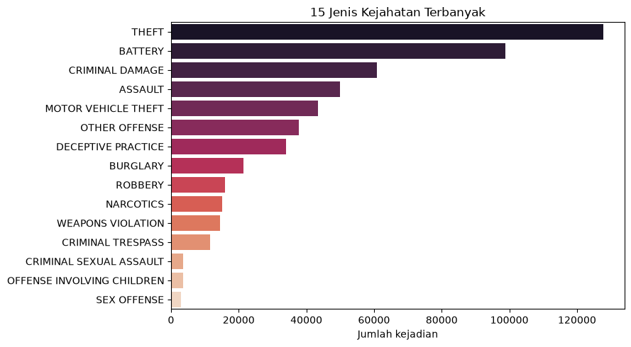
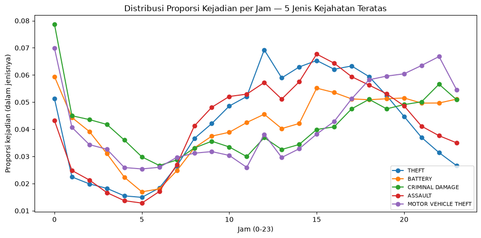
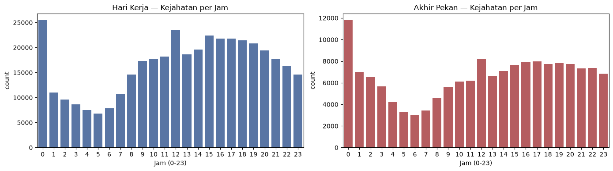
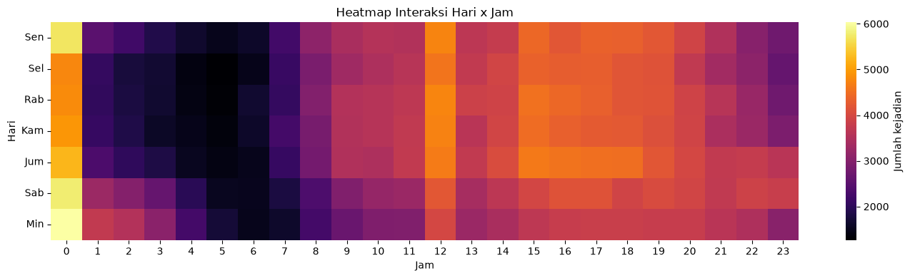
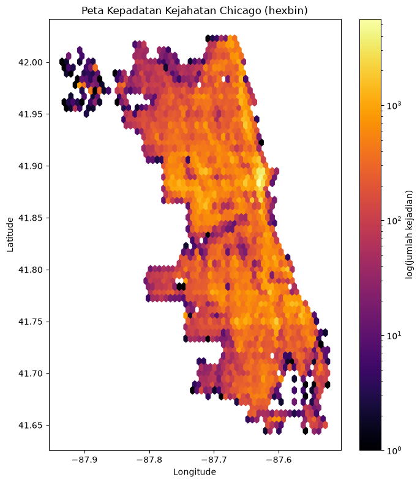

# Chicago Crime Risk Scoring

## Dataset

Chicago Crimes Dataset berisi catatan kejadian kriminal di Kota Chicago yang mencakup informasi waktu kejadian, jenis kejahatan, lokasi, status penangkapan, serta koordinat geografis. Dataset digunakan untuk membangun Risk Score berbasis informasi temporal dan spasial.

Subset yang digunakan pada eksperimen ini mengambil **3 tahun data terakhir** yang tersedia (`Year >= last_year - 2`), dengan justifikasi bahwa pola kejahatan pada rentang tahun terbaru lebih relevan untuk memprediksi risiko saat ini dibanding data yang terlalu lama.

Adapun kolom yang digunakan:

| Nama Kolom | Deskripsi |
|------------|-----------|
| **ID** | Identitas unik untuk setiap data kejadian. |
| **Date** | Tanggal dan waktu terjadinya insiden (dapat berupa estimasi). |
| **Primary Type** | Kategori utama dari tindak kejahatan. |
| **Description** | Deskripsi lebih rinci atau subkategori dari jenis kejahatan. |
| **Location Description** | Deskripsi lokasi tempat kejadian, misalnya jalan, rumah, sekolah, atau toko. |
| **Arrest** | Menunjukkan apakah telah dilakukan penangkapan terhadap pelaku (Ya/Tidak). |
| **Year** | Tahun terjadinya insiden. |
| **Latitude** | Koordinat lintang (latitude) lokasi kejadian yang telah disamarkan. |
| **Longitude** | Koordinat bujur (longitude) lokasi kejadian yang telah disamarkan. |

---

## Design Decisions

- **Severity Scoring:** Setiap kombinasi `Primary Type` + `Description` diberi bobot keparahan (0--100) melalui skema dua level: (1) skor dasar per `Primary Type` yang mencakup hampir seluruh kategori kejahatan pada dataset (bukan satu nilai default global), dan (2) modifier berbasis kata kunci pada `Description` (mis. `ARMED`/`AGGRAVATED` menaikkan skor, `ATTEMPT` menurunkannya, nominal kerugian finansial menyesuaikan skor kejahatan properti). Skala skor dasar disusun berdasarkan tingkat ancaman terhadap keselamatan publik --- kejahatan terhadap nyawa & tubuh (`HOMICIDE`, `CRIM SEXUAL ASSAULT`, `KIDNAPPING`) diberi bobot tertinggi, sementara pelanggaran administratif/tanpa korban langsung (`LIQUOR LAW VIOLATION`, `GAMBLING`) diberi bobot terendah. Modifier `ARMED`/`FIREARM` menaikkan skor karena risiko cedera fisik lebih tinggi, `ATTEMPT` menurunkan skor karena dampak nyata belum terjadi, dan `DOMESTIC` menaikkan skor karena kejahatan domestik cenderung berulang. Pendekatan ini secara signifikan mengurangi persentase kejadian yang jatuh ke nilai fallback dibanding skema satu-default.

- **Temporal Relevance:** Informasi waktu dimodelkan melalui dua mekanisme:
  - *Cyclical encoding* (`sin`/`cos`) pada `hour` dan `dow` agar sifat siklikal waktu (mis. jam 23:00 dekat dengan 00:00) terepresentasi dengan benar, bukan sebagai jarak numerik linear.
  - *Temporal decay* eksponensial dengan *half-life* 180 hari (~6 bulan) --- relevansi sebuah kejadian berkurang separuh setiap 6 bulan, namun tidak pernah benar-benar nol seperti pada peluruhan linear. Parameter ini dipilih dengan asumsi pola kejahatan di suatu lokasi cukup persisten dalam skala bulanan--tahunan, sehingga kejadian setahun lalu masih relevan (~25% bobot) namun kejadian yang jauh lebih lama secara wajar semakin diabaikan.

- **Spatial Relevance:** Lokasi direpresentasikan melalui grid aggregation dengan resolusi 3 desimal koordinat (~110m per sel) --- lebih halus dibanding baseline (2 desimal, ~1.1km) agar risiko lebih spesifik terhadap lokasi, dengan trade-off sparsity yang lebih tinggi (semakin banyak sel dengan sedikit/tanpa kejadian). Untuk mengatasi sparsity ini, dilakukan *spatial smoothing* menggunakan jarak geografis sesungguhnya (`BallTree` dengan metrik haversine) dan bobot kernel Gaussian, menggantikan pendekatan tetangga grid 3×3 tanpa bobot jarak. Radius pencarian tetangga ditetapkan 3km agar mencakup skala lingkungan (*neighborhood*) tanpa mencampur risiko antar-area yang karakteristiknya berbeda, sementara bandwidth 1.5km menentukan kecepatan peluruhan pengaruh terhadap jarak --- sel yang lebih dekat tetap mendominasi, sementara sel di tepi radius memberi kontribusi kecil. Smoothing dilakukan per irisan hari×jam yang sama agar makna "risiko pada waktu tertentu" tidak tercampur antar periode.

- **Feature Representation:** Fitur akhir terdiri dari fitur temporal (`hour`, `dow`, serta bentuk cyclical-nya, dan `is_weekend`), fitur spasial (`cell_id`, `lat_r`, `lon_r`), dan fitur agregat (`crime_count`, `arrest_rate`, dan `violent_share`). `arrest_rate` disertakan sebagai proksi seberapa tertangani kejahatan di suatu lokasi --- rate rendah dapat mengindikasikan risiko yang kurang tertangani oleh penegakan hukum, bukan sekadar rendahnya jumlah kejadian. Fitur-fitur ini dikombinasikan dengan severity dan temporal decay melalui pseudo-labeling untuk membentuk Risk Score, yang kemudian dinormalisasi menggunakan `log1p + min-max` (dipilih setelah dibandingkan dengan percentile rank dan clipping-based scaling, karena distribusinya paling simetris dan tetap mempertahankan urutan magnitude asli).

  > **Catatan keterbatasan:** `crime_count`, `violent_share`, dan `arrest_rate` dihitung dari event dan rentang waktu yang sama dengan yang membentuk `risk_score`, sehingga terdapat korelasi struktural antara fitur dan label (`violent_share` paling signifikan, karena proporsinya berkorelasi langsung dengan skala severity yang membentuk label). Apabila digunakan untuk modeling prediktif lebih baik menggunakan pendekatan **temporal split** (fitur dari satu periode, label dari periode berikutnya) agar model belajar memprediksi risiko ke depan, bukan merekonstruksi label dari komponen pembentuknya sendiri.

---

## EDA Insights

- **Jenis kejahatan paling dominan:** Berdasarkan `value_counts()` pada `Primary Type`, kategori seperti THEFT, BATTERY, dan CRIMINAL DAMAGE mendominasi jumlah kejadian, sementara SEX OFFENSE menjadi kasus kejahatan terendah.

- **Pola temporal:**
  - Proporsi kejadian kejahatan cenderung **paling rendah pada dini hari (02.00–06.00)** untuk hampir semua jenis kejahatan. Memasuki siang hingga sore hari, **Theft** menjadi jenis kejahatan yang paling dominan, sedangkan **Battery** dan **Assault** menunjukkan peningkatan yang jelas dan mencapai puncaknya pada sore hari. Di sisi lain, **Motor Vehicle Theft** lebih sering terjadi pada malam hingga larut malam, sementara **Criminal Damage** memiliki proporsi yang relatif tinggi pada tengah malam dan kembali meningkat pada malam hari. Pola ini menunjukkan bahwa waktu kejadian merupakan faktor penting yang dapat dimanfaatkan dalam pemodelan risiko kejahatan.
  
  

  - Pola kejahatan pada hari kerja dan akhir pekan menunjukkan tren yang serupa, yaitu **jumlah kejadian terendah pada dini hari (02.00–06.00)** dan meningkat mulai pagi hingga mencapai puncak pada **siang hingga malam hari**. Perbedaan utamanya terletak pada volume kejadian, di mana **hari kerja memiliki jumlah kejahatan yang lebih tinggi** hampir di setiap jam dibandingkan akhir pekan.
  
  

  - Heatmap menunjukkan bahwa **dini hari (03.00–06.00)** merupakan periode dengan jumlah kejahatan terendah di hampir semua hari. Sebaliknya, aktivitas kriminal meningkat mulai siang hari dan tetap tinggi hingga sore atau malam. Selain itu, **akhir pekan, terutama Sabtu dan Minggu**, cenderung memiliki jumlah kejadian yang lebih tinggi pada malam hari dibandingkan hari kerja, mengindikasikan adanya pengaruh kombinasi **hari dan waktu** terhadap pola kejahatan.
  
  

- **Pola Spasial:**
Peta kepadatan menunjukkan bahwa kejadian kejahatan **tidak tersebar merata** di seluruh wilayah Chicago. Beberapa area membentuk **hotspot** dengan kepadatan kejadian yang jauh lebih tinggi dibandingkan wilayah lainnya, sedangkan area pinggiran relatif memiliki intensitas yang lebih rendah. Pola spasial ini menunjukkan bahwa **lokasi** merupakan faktor penting yang perlu dipertimbangkan dalam pembentukan *Risk Score*.

---

## Challenges & Reflection

**Challenges**
- Dataset berukuran besar sehingga membutuhkan optimasi penggunaan memori.
- Adanya missing value dan koordinat tidak valid (mis. 0,0) pada beberapa atribut lokasi.
- Menentukan skema severity scoring yang representatif --- baseline dengan satu nilai default global menyebabkan sebagian besar data kehilangan informasi keparahan yang bermakna.
- Grid spasial yang terlalu kasar (2 desimal) kurang presisi terhadap lokasi, sementara grid yang lebih halus (3 desimal) menimbulkan banyak sel sepi kejadian (sparse), sehingga smoothing antar-sel menjadi krusial.
- Normalisasi min--max sederhana rentan terhadap outlier, di mana beberapa sel dengan risiko ekstrem menekan skor seluruh sel lain ke rentang yang sempit.

**Solutions**
- Membaca hanya kolom yang diperlukan (`usecols`) serta membatasi subset ke 3 tahun terakhir untuk menghemat memori dan komputasi.
- Melakukan pembersihan data (drop missing value, filter bounding box Chicago) sebelum feature engineering.
- Menetapkan severity score dua level (skor dasar per `Primary Type` + modifier kata kunci `Description`) untuk memperluas cakupan dan mengurangi ketergantungan pada nilai default.
- Memperhalus grid spasial menjadi 3 desimal, lalu mengatasi sparsity-nya dengan spatial smoothing berbasis jarak geografis sesungguhnya (BallTree haversine + kernel Gaussian) per irisan hari×jam.
- Menggunakan temporal decay eksponensial (half-life) alih-alih linear agar kejadian lama tetap memiliki relevansi kecil, bukan langsung nol.
- Membandingkan beberapa metode normalisasi (min-max, log1p, percentile rank, clipping) secara visual sebelum memilih `log1p + min-max` sebagai metode final, karena menghasilkan distribusi Risk Score paling simetris tanpa menghilangkan informasi magnitude.